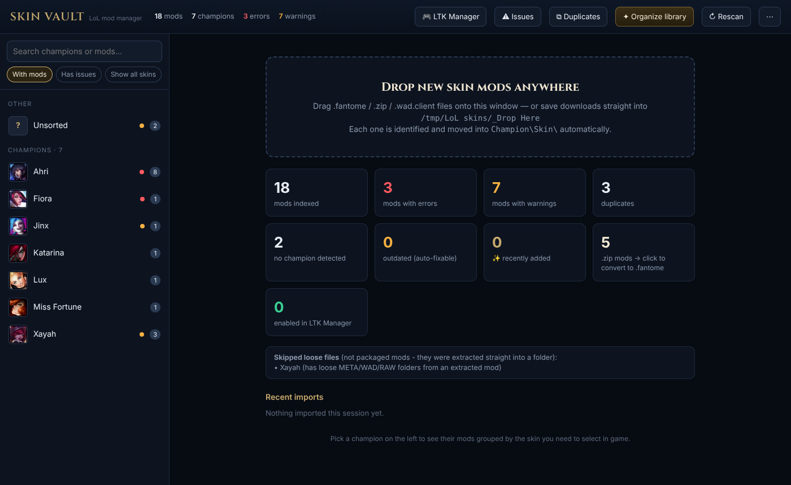
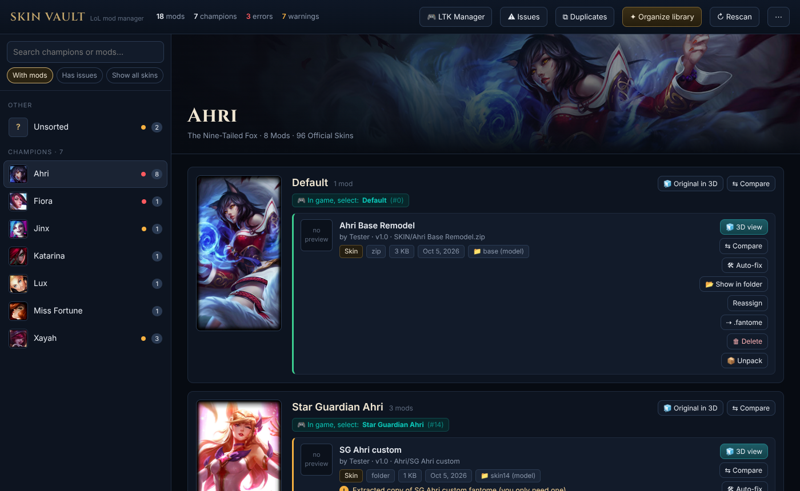

# Skin Vault

A local, browser-based manager for **League of Legends custom skin mods** (`.fantome`, `.zip`, `.wad.client`).
Point it at the folder where you keep your mods and it tells you, for every mod, **which champion and which in-game skin it replaces**, shows the official splash art so you pick the right skin in champ select, flags broken or outdated mods, and keeps the folder sorted for you.



## Features

- **Champion → skin view.** Every mod is grouped under its champion and the exact skin you need to select in game (with splash art and chroma names).
- **Smart detection.** Reads the mod's own files (skin bins, models, textures, the `base/skinN` folder layout) and checks them against the current game's files, so mislabelled mods still land under the right skin. You can override any guess; overrides are remembered.
- **Drag & drop import.** Drop downloads onto the window (or save them into `_Drop Here`). Each one is identified and moved into `Champion\Skin\`. Packs are split and duplicates are caught.
- **Issue checks.** Corrupt archives, `.rar` files, mods built for an old patch ("outdated"), mods in the wrong folder, extracted copies, voice-only WADs and more.
- **Real 3D preview** of the mod next to the original skin, plus **3D compare** for up to three models side by side.
- **NEW tags** on recently added mods.
- **LTK Manager integration** *(optional)*. See what's loaded in [LTK Manager](https://github.com/LeagueToolkit/ltk-manager), and add, remove, enable or disable mods from the site. `.zip` mods are pre-converted to `.fantome` with a visible progress bar, so adding is quick.
- **Auto-fix** *(optional, needs LtMAO-hai)*. Converts DDS → TEX, remaps outdated paths to the current game files, and repacks the mod. The original is kept in `_Originals`.
- **Organize library.** Preview a full re-sort before anything moves, with one-click undo.
- **Safe delete.** Deleted mods go to the Windows Recycle Bin.



## Requirements

- **Windows 10/11** with League of Legends installed. The game files are used for skin matching and the 3D viewer. Without them the manager still works, with less accurate matching.
- **Python 3.9 or newer.** Get it from [python.org](https://www.python.org/downloads/windows/) and tick *"Add python.exe to PATH"* when installing.
- Optional: [LTK Manager](https://github.com/LeagueToolkit/ltk-manager) to load mods into the game.
- Optional: [LtMAO-hai](https://github.com/tarngaina/LtMAO) for auto-fix and `.zip → .fantome` conversion.

## Install & run

1. Download this repo (**Code → Download ZIP**) and extract it anywhere. A good spot is inside your skins folder, e.g. `D:\LoL skins\_Skin Vault`.
2. Double-click **`Start Skin Vault.bat`**.
   - The first launch installs two small Python packages (`zstandard`, `xxhash`).
   - Your browser opens at <http://127.0.0.1:8765>.
3. On first run, choose your mod folder. If Skin Vault sits inside the folder, it's detected automatically.

That's it. Keep the console window open while you use it, and close it to stop.

The League install, LTK Manager and LtMAO-hai are found automatically in their usual places. If one isn't found, set its folder under **⋯ → Folders & tools**.

## Is it safe?

- **Everything runs on your PC.** The server only listens on `127.0.0.1`, rejects requests from other sites, and has no accounts or telemetry.
- The only internet access is fetching public game data:
  - champion names and splash art from Riot's **Data Dragon**;
  - chroma names and file-hash lists from **CommunityDragon**.
- **Nothing is ever hard-deleted:**
  - deletes go to the Recycle Bin;
  - auto-fix keeps originals in `_Originals`;
  - mods removed from LTK are backed up in `data/ltk_removed`;
  - library re-sorts can be undone.

## Troubleshooting

| Problem | Fix |
|---|---|
| "Python was not found" | Install Python 3.9+ from python.org with *Add to PATH* ticked, then run the `.bat` again. |
| Browser didn't open | Go to <http://127.0.0.1:8765> yourself. If something else is using that port, set `"port"` in `config.json`. |
| 3D view says game files not found | Set your League folder (the one containing `Game\`) under **⋯ → Folders & tools**. |
| A mod is under the wrong skin | Click **Reassign** on it. Your choice is saved and survives rescans. |
| Many mods show "outdated" | Riot moved files in a patch. Try **Auto-fix** (needs LtMAO-hai) or get an updated version of the mod. |
| New champion/skin missing, or matching off after a big patch | **⋯ → Update champion & skin list**, then **⋯ → Rebuild file-path database**. |

Logs are written to the `logs` folder. Please include them when opening an issue.

## Configuration

Settings live in `config.json` next to the app and are created on first run. They are editable from the UI. These environment variables override them:

| Variable | Purpose |
|---|---|
| `SKINVAULT_LIBRARY` | Mod folder to manage |
| `SKINVAULT_PORT` | Port (default `8765`) |
| `SKINVAULT_HOME` | Where settings, caches and logs are stored (default: app folder) |
| `SKINVAULT_NO_PIP` | Don't auto-install missing Python packages |

## Development

```
pip install -r requirements.txt
python tests/run_tests.py
```

The tests build a synthetic mod library, so no game files or real mods are needed. Set `SKINVAULT_TEST_GAME=<League folder>` to also test the 3D model builder against real game files. CI runs the suite on Windows and Linux.

```
skin_manager.py   HTTP server, library scanning, skin detection, LTK integration
lol3d.py          WAD / BIN / SKN / SKL / TEX readers and 3D model builder
fixer.py          LtMAO-hai wrapper: auto-fix, zip → fantome, unpack
index.html        the whole UI (single file, vanilla JS)
static/           three.js r160 (vendored so 3D works offline)
data/             bundled champion list + game file hash tables
tests/            synthetic fixtures + test runner
```

## Credits

- [three.js](https://threejs.org/) (MIT) for 3D rendering.
- [CommunityDragon](https://communitydragon.org/) for file hashes and chroma data.
- Riot Games' [Data Dragon](https://developer.riotgames.com/docs/lol#data-dragon) for champion data and art.
- [LtMAO-hai](https://github.com/tarngaina/LtMAO) and [LTK Manager](https://github.com/LeagueToolkit/ltk-manager), which are optional tools this app works alongside.

## Disclaimer

Skin Vault isn't endorsed by Riot Games and doesn't reflect the views or opinions of Riot Games or anyone officially involved in producing or managing Riot Games properties. Riot Games and all associated properties are trademarks or registered trademarks of Riot Games, Inc.

Custom skins only change what **you** see on your own PC. Using mods is still at your own risk with respect to Riot's Terms of Service. Skin Vault only organizes files; it doesn't inject anything into the game.

## License

[MIT](LICENSE)
